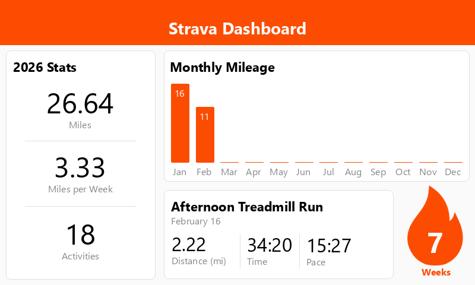
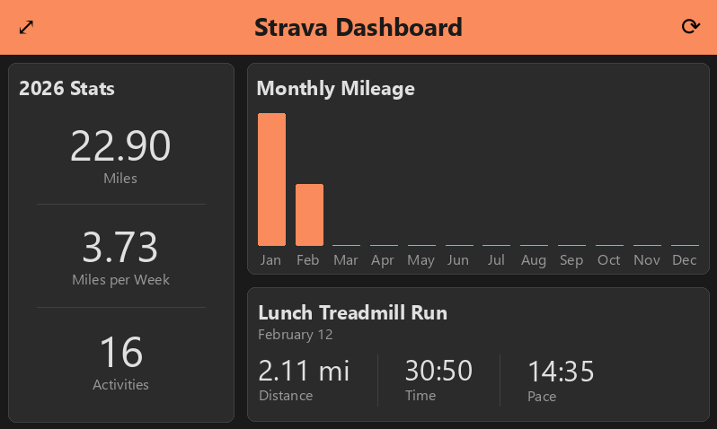
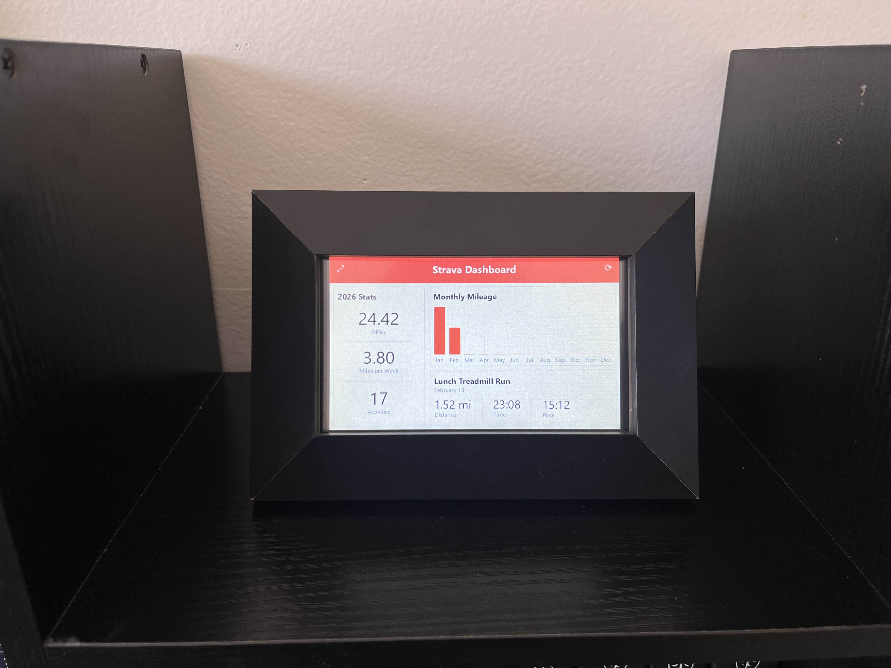

# Strava Frame

A Strava Dashboard I use on my Raspberry Pi frame. This code is not Raspbery Pi specific and I have tested it on Linux Mint and Windows 11 w/ WSL2.

  

## Features

- Strava API Integration
- Yearly stats, monthly mileage, the latest run, and current streak
- Dark Mode and Custom Accent Colors
- Auto Sleep

## Setup

### 1. Install Python

I recommend **Python 3.11**.

### 2. Install Dependencies

```bash
pip install -r requirements.txt
sudo apt update
sudo apt install python3-tk, python3-pil.imagetk
```

### 3. Generate Strava API tokens

1. Go to [Strava API Settings](https://www.strava.com/settings/api).
2. Create a new application if you haven’t already.
3. Copy the following values for your app:
   - **Client ID**
   - **Client Secret**
   - **Refresh Token**
4. Copy `.env-example` to `.env` and add your credentials

```bash
cp .env.example .env
```

Then fill in these values:

```
STRAVA_CLIENT_ID=your_client_id
STRAVA_CLIENT_SECRET=your_client_secret
STRAVA_REFRESH_TOKEN=your_refresh_token
```

### 4. Grant `read_all` permission

1. Run the following to generate a new refresh token with `read_all` permission

```bash
chmod +x token.sh
./token.sh
```

2. You will be prompted to open a link in your browser. After opening the link, click "Authorize"

3. After clicking "Authorize", you will be redirected to an error page. Copy the value from the `code=` query parameter of the URL in the browser

4. Paste the value into your terminal. Copy the newly generated refresh token and replace the value in your `.env` file.

## Usage

```bash
usage: main.py [-h] [-c COLOR] [-f] [-d]

Strava Frame

options:
  -h, --help            show this help message and exit
  -c COLOR, --color COLOR
                        set accent color (must be hexadecimal color value ex: FC4C02)
  -f, --fullscreen      run in fullscreen mode
  -d, --darkmode        use dark mode

Keyboard shortcuts: F11 = toggle fullscreen | Escape = quit | r = refresh
```

## Frame Setup

### 1. Buy the Hardware

This is the hardware I used for this project, and it was all plug-and-play except the touchscreen drivers for the display:

- Raspberry Pi 2B (newer models should be compatible with the rest of the hardware)
- [USB WiFi Adapter for Raspberry Pi](https://www.amazon.com/dp/B06Y2HKT75?ref=ppx_yo2ov_dt_b_fed_asin_title)
- [ELECROW 5-Inch Resistive Touch Screen TFT LCD Display](https://www.amazon.com/dp/B013JECYF2?ref=ppx_yo2ov_dt_b_fed_asin_title)
- [Micro USB to USB C angled adapter](https://www.amazon.com/dp/B0CSKB3KG7?ref=ppx_yo2ov_dt_b_fed_asin_title&th=1): This helps hide the cable, since the connection is at the top
- [Picture Frame](https://www.michaels.com/product/basics-studio-black-tabletop-frame-by-studio-decor-10759580?michaelsStore=3716&inv=2): This is the specific frame I used. I had to add a cutout for the HDMI connector and I had to sand the inside bottom of the frame to get things aligned properly.

### 2. Set Up the Display Drivers

```bash
git clone https://github.com/goodtft/LCD-show.git
chmod -R 755 LCD-show
cd LCD-show
sudo ./LCD5-show
```

### 3. Turn Off Screen Blanking

Go to Preferences -> Control Center -> Display and turn off the toggle for screen blanking.

### 4. Turn Off Notifications

Right click the task bar and then go to Panel Settings -> Notifications and turn off notifications

### 5. Set Up an Easy Way to Start the Dashboard

Either follow the steps below to make an autoscript or just have a bash script on the desktop that starts the code. Personally, I have both and its convenient with the touchscreen. For the Desktop script, just make sure to save the file with extension `.sh`. It'll then prompt you to execute the script.

```
python3 /home/{username}/path/to/your/project/src/main.py [args] &
```

## Setting Up Autostart on Raspbian (Labwc)

### 1. Create the Labwc autostart directory (if it doesn't exist)

```bash
mkdir -p ~/.config/labwc
```

### 2. Create the autostart file

```bash
touch ~/.config/labwc/autostart
```

Add this line to the file (replace `/home/pi/path/to/your/project` with your actual project path):

```bash
sleep 60 && python3 /home/{username}/path/to/your/project/src/main.py [args] &
```

**NOTE:** The `sleep` is needed otherwise the dashboard does not start in fullscreen and does not connect to wifi

### 3. Make the autostart file executable

```bash
chmod +x ~/.config/labwc/autostart
```

### 6. Test by rebooting

```bash
sudo reboot
```

### 7. Troubleshooting

If the dashboard doesn't start in fullscreen:

- Press **F11** or the fullscreen button to toggle fullscreen mode
- If it doesn't start at all, increase the sleep delay
