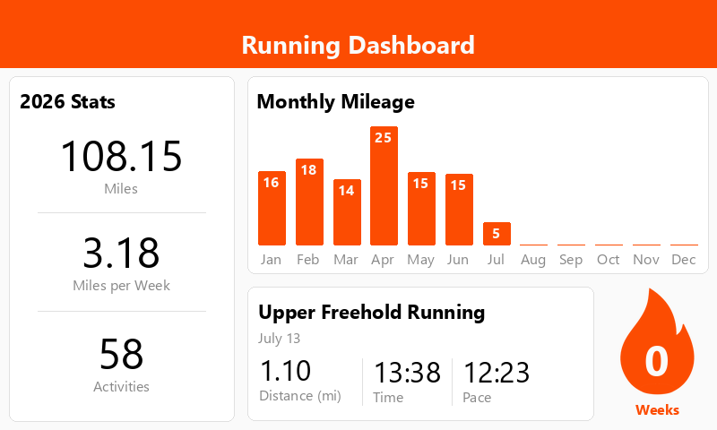

# Running Frame

A running dashboard I use on my Raspberry Pi frame, backed by Intervals.icu. This code is not Raspbery Pi specific and I have tested it on Linux Mint and Windows 11 w/ WSL2.



## Features

- Intervals.icu API Integration (Garmin Connect as the data source)
- Yearly stats, monthly mileage, the latest run, and current weekly streak
- Dark Mode and Custom Accent Colors
- Auto Sleep

## Setup

### 1. Install Python

### 2. Install Dependencies

```bash
pip install -r requirements.txt
sudo apt update
sudo apt install python3-tk, python3-pil.imagetk
```

### 3. Create an Intervals.icu account

1. Sign up at [intervals.icu](https://intervals.icu).
2. Go to **Settings** and click **Connect** next to **Garmin Connect**.

Activities sync within about 5 minutes of your watch syncing to Garmin Connect.
Intervals.icu backfills roughly a year of history, which arrives gradually over the
first few hours after connecting.

### 4. Generate a config file

```bash
cp config-example.toml config.toml
```

Then get your API key from **Settings -> Developer Settings** on Intervals.icu and fill
in `api_key`. Leave `athlete_id` as `"0"` unless you want to be explicit about it.

#### `streak_carryover`

The streak counts consecutive weeks containing at least one run, computed fresh from the
trailing 12 months on every refresh. Anything inside that window self-corrects, so
deleted runs, late syncs and backdated activities all just work.

Only ~52 weeks are visible, though, so a streak older than that would silently cap.
`streak_carryover` is the number of consecutive weeks your streak had already reached
before the window begins. Leave it `0` unless your streak is longer than a year, and
reset it to `0` if you ever break one that was.

## Usage

```bash
python3 src/main.py
```

## Troubleshooting

If the app crashes, then the error log is written to a `logs` directory in the root of the repository.

## Frame Setup

### 1. Buy the Hardware

This is the hardware I used for this project, and it was all plug-and-play except the touchscreen drivers for the display:

- Raspberry Pi 2B (newer models should be compatible with the rest of the hardware)
- [USB WiFi Adapter for Raspberry Pi](https://www.amazon.com/dp/B06Y2HKT75?ref=ppx_yo2ov_dt_b_fed_asin_title)
- [ELECROW 5-Inch Resistive Touch Screen TFT LCD Display](https://www.amazon.com/dp/B013JECYF2?ref=ppx_yo2ov_dt_b_fed_asin_title)
- [Micro USB to USB C angled adapter](https://www.amazon.com/dp/B0CSKB3KG7?ref=ppx_yo2ov_dt_b_fed_asin_title&th=1): This helps hide the cable, since the connection is at the top
- [Picture Frame](https://www.michaels.com/product/basics-studio-black-tabletop-frame-by-studio-decor-10759580?michaelsStore=3716&inv=2): This is the specific frame I used. I had to add a cutout for the HDMI connector and I had to sand the inside bottom of the frame to get things aligned properly.

### 2. Set Up the Display Drivers

```bash
git clone https://github.com/goodtft/LCD-show.git
chmod -R 755 LCD-show
cd LCD-show
sudo ./LCD5-show
```

### 3. Turn Off Screen Blanking

Go to Preferences -> Control Center -> Display and turn off the toggle for screen blanking.

### 4. Turn Off Notifications

Right click the task bar and then go to Panel Settings -> Notifications and turn off notifications

### 5. Set Up an Easy Way to Start the Dashboard

Either follow the steps below to make an autoscript or just have a bash script on the desktop that starts the code. Personally, I have both and its convenient with the touchscreen. For the Desktop script, just make sure to save the file with extension `.sh`. It'll then prompt you to execute the script.

```
python3 /home/{username}/path/to/your/project/src/main.py &
```

## Setting Up Autostart on Raspbian (Labwc)

### 1. Create the Labwc autostart directory (if it doesn't exist)

```bash
mkdir -p ~/.config/labwc
```

### 2. Create the autostart file

```bash
touch ~/.config/labwc/autostart
```

Add this line to the file (replace `/home/pi/path/to/your/project` with your actual project path):

```bash
sleep 60 && python3 /home/{username}/path/to/your/project/src/main.py &
```

**NOTE:** The `sleep` is needed otherwise the dashboard does not start in fullscreen and does not connect to wifi

### 3. Make the autostart file executable

```bash
chmod +x ~/.config/labwc/autostart
```

### 6. Test by rebooting

```bash
sudo reboot
```
